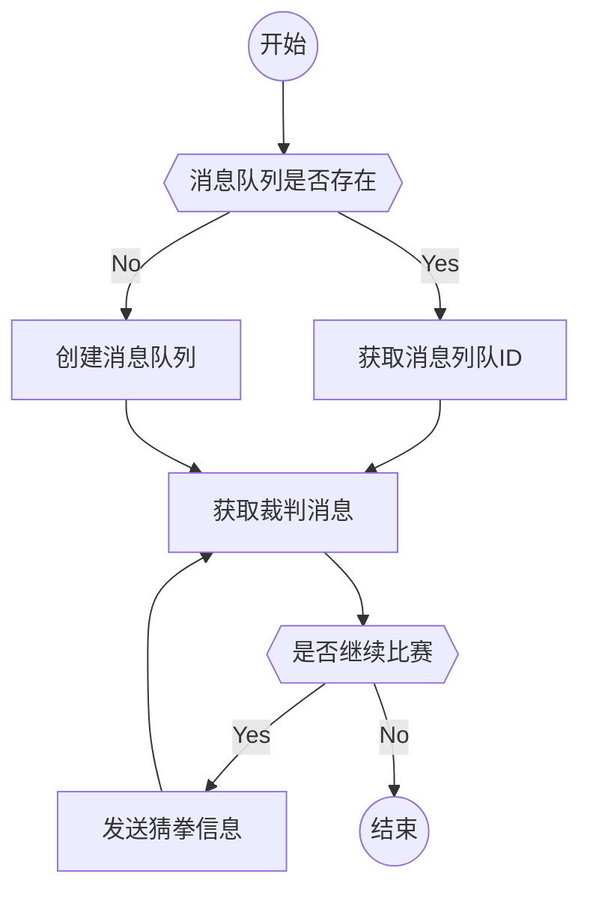
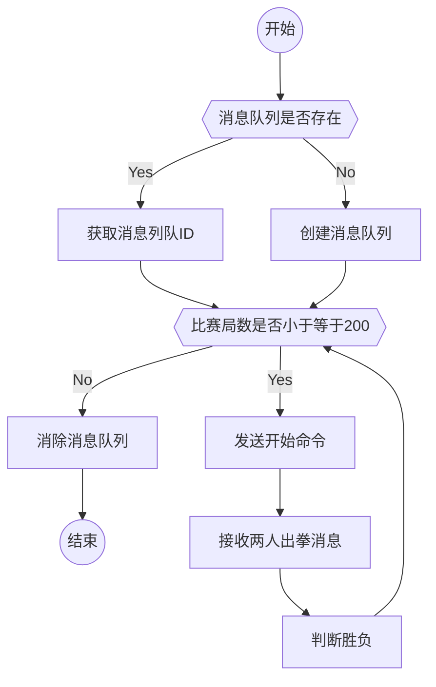

# 操作系统实验报告

## 实验步骤1的数据结构

### 1. 玩家猜拳消息

```c
char *CONDITIONS[] = {"布", "剪刀", "石头"};

struct data {
    struct timeval time;    // 存放出拳的时间
    int fgguss; // 2: 石头; 1: 剪刀; 0: 布
};

struct gamemsg {
    long int msgtype;   // 消息类型
    struct data mydata;     // 消息内容
};
```

- `gamemsg` 存放了消息。其中`msgtype`说明了消息的类型，`mydata`作为一个结构体则存放了消息的具体内容。
- `data`结构体中有一个时间变量`time`用来存放玩家出拳时的时间，以便后面判断出拳是否超时。另一个int型变量`fgguss`存放了玩家的具体出拳。规则如下：
  - 2 - 石头
  - 1 - 剪刀
  - 0 - 布
- `CONDITIONS`用来在输出时将数字转化成文字

### 2. 裁判的开始命令

```c
struct startmsg {
    long int msgtype;
    int se; // se=1: 开始 se=0: 游戏结束
};
```

- `startmsg`开始命令消息
  - `msgtype`存放了说明了消息类型
  - `se`是一个int型变量，1代表开始 0代表结束

## 实验步骤1的大小规则

### 1. 判断函数代码

```c
// 用来判断哪一方赢得比赛
// 返回的数 >0: player1赢; =0: 平局; <0: player2赢
int judge(int ans1, int ans2) {
        if (ans1 == 2 && ans2 == 0)
            return -1;
        else if (ans1 == 0 && ans2 == 2)
            return 1;
        return ans1 - ans2;
}
```

- 先判断特殊情况（石头，布）和（布，石头），返回相应的结果。其余利用数的特性，直接返回相减之后的结果
- 返回值说明：返回一个大于0的数-玩家一赢；返回一个等于0的数-玩家二赢；返回一个小于0的数-玩家二赢

## 实验步骤2的结构

```c
int gameboard[MATCHES]; // 每局的胜负情况
long int time_p1[MATCHES];  // 玩家一每局所用的时间
long int time_p2[MATCHES];  // 玩家二每局所用的时间
int p1_win = 0, p2_win = 0, tie = 0;
```

- `gameboard`储存每局的胜负情况
- `time_p1`储存玩家一每局所用的时间
- `time_p2`储存玩家二每局所用的时间
- `p1_win, p2_win, tie`分别存储玩家一赢的局数，玩家二赢的局数，平局的数量

## 实验步骤3中，你所选择的IPC方法

答：消息队列。

## 实验步骤3，为何选择该方法

答：

1. 管道一般用于父子进程间通信，而消息队列可用于不同进程间的通信，只要进程有权操作消息队列。
2. 消息队列进行双向通信不用设置读端和写端，一个消息队列中可以发送或接收多个类型的消息。

## 实验步骤3，如果选择消息队列机制，描述消息缓冲区结构

```c
struct data {
    struct timeval time;
    int fgguss; // 2: 石头; 1: 剪刀; 0: 布
};

struct gamemsg {
    long int msgtype;
    struct data mydata;
};
```

- `msgtype`是一个长整形变量，代表消息里存放数据的类型
- `mydata`是消息中存放的数据，是一个结构体类型的变量，里面的内容是：
  - `time`代表出拳的时间
  - `fgguss`代表出拳的类型

## 实验步骤4，如何创建 IPC 资源

### 创建消息队列——代码示例

```c
key = ftok("/tmp", 77);
player_id = msgget(key, IPC_CREAT | 0666);
```

- `ftok`函数生成键值，每一个消息队列都有一个对应的键值（key）相关联。
- `msgget`函数创建消息队列
  `int msgget(key_t key,int flag)`
  - key为ftok生成的键值
  - flag为所需要的操作和权限，可以用来控制创建一个消息队列。
    - flag的值为IPC_CREAT：如果不存在key值的消息队列，且权限不为0，则创建消息队列，并返回一个消息队列ID。如果存在，则直接返回消息队列ID。
    - flag的值为 IPC_CREAT | IPC_EXCL：如果不存在key值的消息队列，且权限不为0，则创建消息队列，并返回一个消息队列ID。如果存在，则产生错误。
  - 返回值：成功返回消息队列ID；出错返回-1

## 实验步骤5，程序主要流程或关键算法

### 流程图



### 核心代码

```c
// 接收裁判口令
if (msgrcv(player_id, (void *)&smsg, sizeof(int), 1, 0) < 0) {
    fprintf(stderr, "Error: failed to receive message[player]\n");
    perror("msgrcv");
    exit(EXIT_FAILURE);
}

if (smsg.se == 0) {
    break;  // 游戏结束
}

// 猜拳并将猜拳内容封装成消息发送
struct data mydata;

int finger = rand() % 3;
gettimeofday(&mydata.time, 0);
mydata.fgguss = finger;
gmsg.mydata = mydata;

// 各自的出拳
if (fpid == 0)
    printf("【玩家一】：我出%s\n", CONDITIONS[finger]);
else
    printf("【玩家二】：我出%s\n", CONDITIONS[finger]);

// 发送消息
if (msgsnd(player_id, (void *)&gmsg, sizeof(mydata), 0) < 0) {
    fprintf(stderr, "Error: failed to send message[player]\n");
    perror("msgsnd");
    exit(EXIT_FAILURE);
}
```

## 实验步骤6，程序主要流程或关键算法

### 流程图



### 核心代码

```c
// 裁判发出开始口令
smsg.se = 1;
if (msgsnd(p1msg_id, (void *)&smsg, sizeof(int), 0) < 0) {
    fprintf(stderr, "Error: failed to send a message to player1[judge]\n");
    perror("msgsnd");
    exit(EXIT_FAILURE);
}
if (msgsnd(p2msg_id, (void *)&smsg, sizeof(int), 0) < 0) {
    fprintf(stderr, "Error: failed to send a message to player2[judge]\n");
    perror("msgsnd");
    exit(EXIT_FAILURE);
}

// 裁判接收两人的出拳情况
struct data mydata;
struct timeval endtime;
if (msgrcv(p1msg_id, (void *)&gmsg1, sizeof(mydata), 2, 0) < 0) {
    fprintf(stderr, "Error: failed to receive a message from player1[judge]\n");
    perror("msgrcv");
    exit(EXIT_FAILURE);
}
gettimeofday(&endtime, 0);
int fgguss1 = gmsg1.mydata.fgguss;
long int time1 = 1000000*(endtime.tv_sec - gmsg1.mydata.time.tv_sec) + (endtime.tv_usec - gmsg1.mydata.time.tv_usec);
if (msgrcv(p2msg_id, (void *)&gmsg2, sizeof(mydata), 2, 0) < 0) {
    fprintf(stderr, "Error: failed to receive a message from player2[judge]\n");
    perror("msgrcv");
    exit(EXIT_FAILURE);
}
gettimeofday(&endtime, 0);
int fgguss2 = gmsg2.mydata.fgguss;
long int time2 = 1000000*(endtime.tv_sec - gmsg2.mydata.time.tv_sec) + (endtime.tv_usec - gmsg2.mydata.time.tv_usec);

// 储存数据
int judgement = judge(fgguss1, fgguss2);
gameboard[i] = judgement;
time_p1[i] = time1;
time_p2[i] = time2;

if (judgement > 0)
    p1_win++;
else if (judgement == 0)
    tie++;
else
    p2_win++;
```

## 实验部分结果的展示

- **运行中的裁判程序**


- **运行中的选手程序**


- **结果输出**

